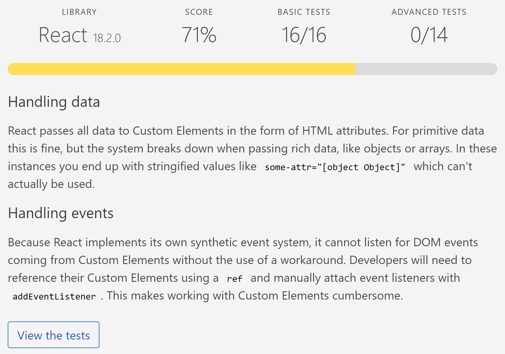
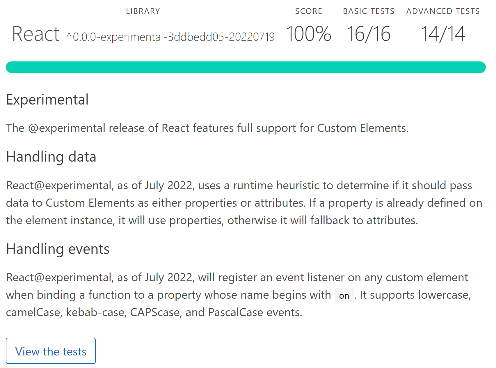

This utility library creates a React component that serves as a thin wrap around an arbitrary custom element.
 It is used to mitigate the gaps present in React versions until **19.x**
 * Relay custom events that are not natively supported to callback
 * Handles properties as well as attributes on a custom element

# Rationale

At present(**early 2023**) we as a community of React users are still in between of two points in time:
* React **18.2** (June 14, 2022)
* React **19** (?unknown release date?) *Native support of Web Components promised to be delivered near version **19***

This means we can't use Web Components with the React happily together because

[](https://custom-elements-everywhere.com)

and **somwhere** in the *future* this might be better

[](https://custom-elements-everywhere.com)


## Alternative solutions
* Microsoft has it's own home brewed solution for the very same issue
https://github.com/microsoft/fast/tree/master/packages/utilities/fast-react-wrapper
as a mitigation for their [fast.design](http://fast.design) system. Why this is not a production ready solution? because it's still Alpha quality, so we cannot actually use it just now
* https://github.com/BBKolton/reactify-wc
* https://github.com/lit/lit/tree/main/packages/labs/react

## Articles on topic

* https://dev.to/marcushellberg/exploring-reacts-newly-added-web-component-support-19i7
* https://dev.to/thepassle/reactifying-custom-elements-using-a-custom-elements-manifest-2e
* https://www.fast.design/docs/integrations/react

## **Getting Started**

To install react wrapper in your project, run:

```npm i @vonage/vivid-react-wrapper```

In order to use it in your code, just import the wrapper function into your project, then invoke it with the configuration that's relevant to the element you're wrapping.

```javascript
import React from "react";
import ReactDOM from "react-dom";
import "@material/mwc-textarea";
import wrapper from "@vonage/vivid-react-wrapper";

const MwcTextarea = wrapper('mwc-textarea',  {
    events: ["change"],
    attributes: ["disabled"]
});
```

Then you can use the generated component as you would any other React component. Supplying callbacks for events and attribute values as properties:

```javascript
ReactDOM.render(
    <MwcTextarea
      disabled="true"
      onClick={ console.log }
      onChange={ console.log }
      ref={ console.log }
      value="hello">
    </MwcTextarea>,
    document.body
);
```

The wrapper function takes two arguments
* The name of the custom element to wrap
* An options object containing two fields:
  * `events`: An array of events that the wrapper should handle. For instance, the "change" event isn't handled by React automatically, so we'd want to add "onChange" to the list of events. To consume these events, all you need is to assign a callback property "onChange" to the React element instance.
  * `attributes`: An array of attributes that the wrapper should relay to the element. Some element attributes are assigned/removed instead of set value to (as in the case of the "disabled" attribute).

All properties that have not been explicitly configured to be handled by the wrapper, including "ref" will be transferred to the element natively by React.

## Extended Configuration

```javascript
import "@material/mwc-textarea";
import wrapper, { attributeSetterValue, attributeSetterToggle } from "@vonage/vivid-react-wrapper";

const MwcTextarea = wrapper('mwc-textarea',  {
    events: [
        { name: "change", propName: 'onChange', transform: (e) => e.target.value }
    ],
    attributes: [
        { name: "disabled", setter: attributeSetterToggle },
        { name: "placeholder", setter: attributeSetterValue }
    ]
});
```

## Releasing new version

* Bump the version in `package.json` commit & push the change to the master
* Run `Pipeline` workflow manually
